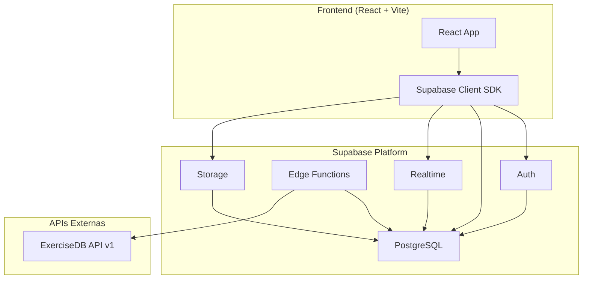
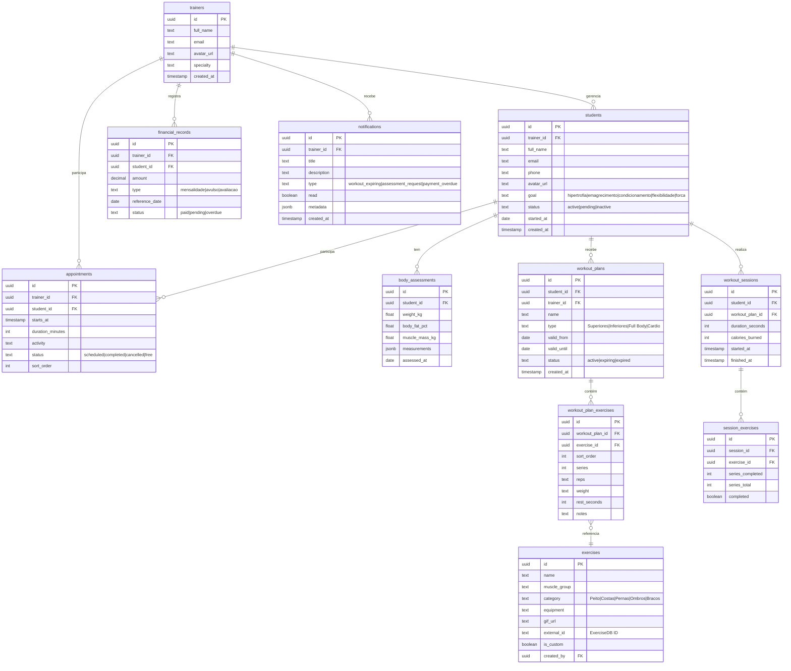
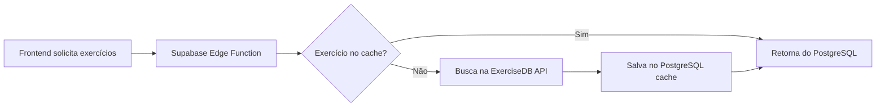
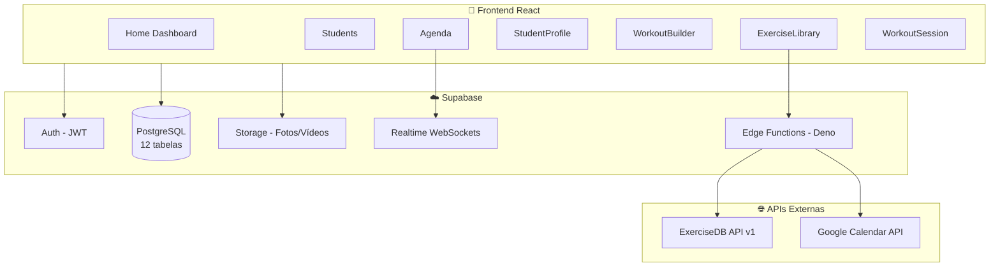

# 🏋️ Planejamento de Backend — Personal Tech

## Visão Geral

O **Personal Tech** é um dashboard mobile-first para Personal Trainers, construído com React + Vite + TypeScript + styled-components. Atualmente todos os dados são **mock/hardcoded** no frontend. Este documento propõe a arquitetura completa de backend para transformá-lo em uma aplicação funcional.

---

## 1. Inventário Completo do Frontend

### Componentes Funcionais (com lógica/interação)

| View / Componente | Dados Mock | Funcionalidades |
|---|---|---|
| **Home** (Dashboard) | Hardcoded | Agrega Header, StatsCards, StudentsList, AlertSection, RevenueWidget |
| **Students** | `studentsData[]` (5 alunos) | Busca, filtro (Todos/Ativos/Pendentes/Inativos), navegação para perfil |
| **Agenda** | `initialSchedule[]` (5 itens) | Calendário semanal, timeline com drag-and-drop, indicador "AGORA" |
| **StudentProfile** | Hardcoded (João Victor) | Estatísticas (peso/BF%/treinos), histórico de treinos, próxima meta |
| **WorkoutBuilder** | 3 exercícios mock | Criar treino (nome, aluno, exercícios com séries/reps/carga/descanso) |
| **ExerciseLibrary** | 10 exercícios mock | Busca, filtro por categoria, selecionar exercícios com detalhes |
| **WorkoutSession** | 2 treinos mock (A/B) | Timer, checklist exercícios, descanso com countdown, celebração final |

### Componentes Não-Funcionais (apenas visuais/layout)

| Componente | O que exibe |
|---|---|
| **Header** (Dashboard) | Avatar, "Coach Silva", notificações (hardcoded) |
| **StatsCards** | "24 Alunos Ativos" e "05 Treinos Hoje" (hardcoded) |
| **StudentsList** | Lista horizontal de próximos alunos (hardcoded) |
| **AlertSection** | 2 alertas fixos (treino vencendo, avaliação física) |
| **RevenueWidget** | Faturamento semanal R$2.450 com gráfico de barras (hardcoded) |
| **BottomNav** | Navegação inferior (Home, Alunos, +, Agenda, Perfil) |

---

## 2. Arquitetura Proposta

### 🎯 Recomendação: **Supabase** (Backend-as-a-Service)

> [!TIP]
> Supabase é a escolha ideal para este projeto por vários motivos:
> - O projeto já tem experiência prévia com Supabase (histórico de conversas)
> - PostgreSQL nativo com Row Level Security (RLS)
> - Auth integrado (email, Google, social logins)
> - Realtime subscriptions (atualizações em tempo real da agenda)
> - Storage para fotos de alunos e vídeos de exercícios
> - SDK JavaScript oficial com tipos TypeScript
> - Tier gratuito generoso para estudo/desenvolvimento

### Diagrama de Arquitetura



### Stack Tecnológica

| Camada | Tecnologia | Justificativa |
|---|---|---|
| **Banco de Dados** | PostgreSQL (Supabase) | Relacional, robusto, RLS nativo |
| **Autenticação** | Supabase Auth | JWT, social login, refresh tokens |
| **API REST** | Supabase Auto-generated REST (PostgREST) | API automática a partir do schema |
| **Serverless Functions** | Supabase Edge Functions (Deno) | Para lógica customizada e integração com APIs |
| **Realtime** | Supabase Realtime | WebSockets para agenda e notificações |
| **File Storage** | Supabase Storage | Fotos de alunos, thumbnails de exercícios |
| **API de Exercícios** | ExerciseDB API v1 | Gratuita, open-source, 1500+ exercícios com GIFs |

---

## 3. Modelagem do Banco de Dados



---

## 4. API de Exercícios — Integração com ExerciseDB

> [!IMPORTANT]
> A **ExerciseDB API v1** é a melhor opção para integração. É **100% gratuita e open-source**, com mais de **1.500 exercícios** incluindo GIFs animados demonstrativos.

### Comparação de APIs Pesquisadas

| API | Exercícios | GIFs/Vídeos | Gratuita | Ideal Para |
|---|---|---|---|---|
| **ExerciseDB v1** ⭐ | 1.500+ | ✅ GIFs | ✅ 100% grátis | Melhor opção geral |
| API Ninjas | 3.000+ | ❌ | Parcialmente (5/busca) | Textos/instruções |
| Workout API (Zyla) | Variável | Parcialmente | Trial apenas | Recomendações prontas |

### Estratégia de Integração



1. **Seed inicial**: Importar os exercícios mais comuns da ExerciseDB para a tabela `exercises`
2. **Cache inteligente**: Edge Function busca na API e cacheia no banco
3. **Exercícios customizados**: O personal pode criar exercícios próprios (`is_custom = true`)
4. **GIFs**: URLs de GIFs armazenados diretamente (ExerciseDB hospeda publicamente)

### Endpoints da ExerciseDB que seriam usados

| Endpoint | Uso no App |
|---|---|
| `GET /exercises` | Biblioteca de exercícios (ExerciseLibrary) |
| `GET /exercises/bodyPart/{bodyPart}` | Filtro por categoria (Peito, Costas, etc.) |
| `GET /exercises/name/{name}` | Busca por nome |
| `GET /exercises/target/{target}` | Filtro por músculo alvo |
| `GET /exercises/equipment/{equipment}` | Filtro por equipamento |

---

## 5. Mapeamento Frontend → Backend

### Quais dados cada tela consumiria do backend

| View | Tabelas do Backend | Operações |
|---|---|---|
| **Home** | `trainers`, `students`, `appointments`, `financial_records`, `notifications` | Leitura (dashboard stats) |
| **Students** | `students` | CRUD + busca + filtro por status |
| **Agenda** | `appointments` | CRUD + reordenar (drag-and-drop) + Realtime |
| **StudentProfile** | `students`, `body_assessments`, `workout_sessions`, `workout_plans` | Leitura + navegação |
| **WorkoutBuilder** | `workout_plans`, `workout_plan_exercises`, `exercises` | Criar/editar treino |
| **ExerciseLibrary** | `exercises` (+ ExerciseDB API) | Busca + filtro + seleção |
| **WorkoutSession** | `workout_sessions`, `session_exercises`, `workout_plan_exercises` | Criar sessão + atualizar progresso |
| **StatsCards** | Queries agregadas: `COUNT(students)`, `COUNT(appointments WHERE today)` | Leitura |
| **RevenueWidget** | `financial_records` (SUM por dia da semana) | Leitura |
| **AlertSection** | `notifications` WHERE `read = false` | Leitura + marcar como lido |

---

## 6. Sugestões Adicionais para o Backend

### 🚀 Funcionalidades Bônus Recomendadas

1. **Avaliações Físicas Periódicas**
   - Histórico de medidas corporais (peso, BF%, circunferências)
   - Gráficos de evolução ao longo do tempo
   - Tabela `body_assessments` já contempla isso

2. **Sistema de Notificações Push**
   - Lembrete de treino para o aluno
   - Alerta de plano vencendo para o personal
   - Integração com Web Push API ou Firebase Cloud Messaging

3. **Portal do Aluno (PWA)**
   - O aluno acessa seus treinos e progresso via link
   - Autenticação separada (magic link por email)
   - Visualiza treino do dia, marca exercícios como feitos

4. **Relatórios e Analytics**
   - Supabase + Views SQL para relatórios
   - Volume total de treino por semana/mês
   - Taxa de frequência dos alunos
   - Receita mensal vs projetada

5. **Backup de Vídeos de Exercício**
   - Supabase Storage para vídeos/fotos de referência
   - O personal grava demonstrações personalizadas
   - Vinculados aos exercícios customizados

6. **Integração com Google Calendar**
   - Sincronizar a agenda do personal com Google Calendar
   - Edge Function usando Google Calendar API

---

## 7. Row Level Security (RLS)

> [!CAUTION]
> RLS é **essencial** para segurança. Cada personal trainer deve ver **apenas seus próprios dados**.

```sql
-- Exemplo: Apenas o trainer dono vê seus alunos
CREATE POLICY "trainers_own_students" ON students
  FOR ALL USING (trainer_id = auth.uid());

-- Exemplo: Apenas o trainer dono vê seus appointments
CREATE POLICY "trainers_own_appointments" ON appointments
  FOR ALL USING (trainer_id = auth.uid());
```

---

## 8. Resumo da Arquitetura



### Próximos Passos (se for implementar)

1. Criar projeto Supabase e configurar Auth
2. Executar migrations SQL com o schema acima
3. Configurar RLS policies
4. Criar Edge Function para sincronizar com ExerciseDB
5. Instalar `@supabase/supabase-js` no frontend
6. Substituir dados mock por queries reais, view por view
7. Adicionar Realtime na Agenda
8. Deploy: Supabase (backend) + Vercel/Netlify (frontend)

---

> [!NOTE]
> Este documento é um **estudo de caso** para planejamento. A implementação real envolveria criação do projeto Supabase, migrations SQL, e refatoração progressiva do frontend para consumir dados reais.
